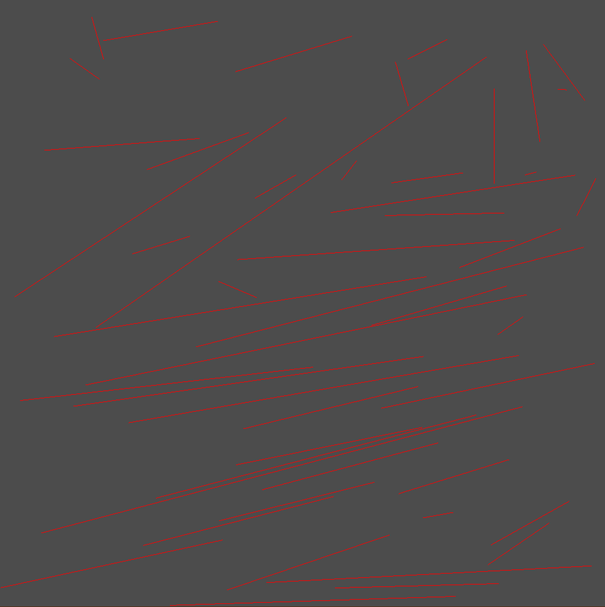

# Untangling Segments

There are two disjoint sets of N points, where no three points are collinear. The task is to create line segments out of pair of points, where one point is selected from one set and the other from the other, where no segments intersect.

# Proposed solution

Three solutions have been analysed: algorithm based on an angle sort, algorithm based on the Hungarian algorithm and a brute force approach for comparison.

## Bruteforce
Slow but gets the job done.

## Angle sort
Lightning fast, all the segments will be long and skewed towards one direction.

## Hungarian algorithm
Slower than angle sort, faster than bruteforce, also creates segments with the smallest total length.

